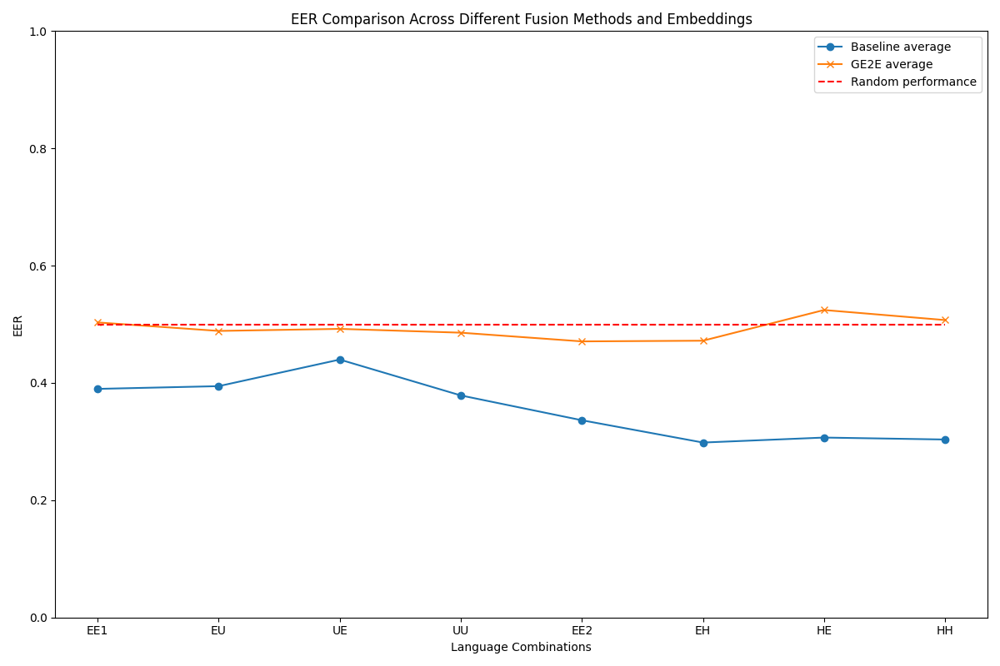

# FAME'24 Challenge (Face-voice Association in Multilingual Environments 2024)

# Baseline
Baseline code for v2 of MAV-Celeb dataset based on _'Fusion and Orthogonal Projection for Improved Face-Voice Association'_ [{paper}](https://ieeexplore.ieee.org/abstract/document/9747704) [{paper code}](https://github.com/msaadsaeed/FOP) [{baseline repo}](https://github.com/mavceleb/mavceleb_baseline.git)

## Task
Face-voice association is established in cross-modal verification task, where the goal is to verify if, in a given single sample with both a face and voice, both belong to the same identity. 

The FAME challenge, in addition, enforces analysis of the impact of multiple of languages on cross-modal verification task.

### Baseline (two-stream approach) visualization
<p align='center'>
  
</p>

## Evaluation Protocol
The aim is to study the impact of language on face-voice assoication methods.
Model X trained on language A is tested both on the same language A and unheard language B. Similarly a model Y trained on language B is tested both on same language B and unheard language A.

For example in v2 setting language A is English and language B is Hindi, then the whole pipeline looks as shown in figures below. 
<br>
<p align='center'>
  
  
</p>

It is also important to note that the test identities are in any of the cases unheard by the network meaning the test set is disjoint from the train network. 

For example: v2 has 84 identities both having English and Hindi voice samples. But 6 identities are reserved for test set while reamining are used for training the model.

# Results
## Baseline Results from Paper Authors
<table border="1" align='center'>
  <tr>
    <td colspan="4" align="center"><b>V1-EU</b></td>
  </tr>
  <tr>
    <td></td>
    <td></td>
    <td align='center'>English test<br>(EER)</td>
    <td align='center'>Urdu test<br>(EER)</td>
  </tr>
  <tr>
    <td rowspan="2" align="center">FOP</td>
    <td>English train</td>
    <td><b>29.3</b></td>
    <td>37.9</td>
    <td rowspan="2" align="center"><b>33.4</b></td>
  </tr>
  <tr>
    <td>Urdu train</td>
    <td>40.4</td>
    <td><b>25.8</b></td>
  </tr>
  
  <tr>
    <td colspan="4" align="center" ><b>V2-EH</b></td>
  </tr>
  <tr>
    <td>Method</td>
    <td>Configuration</td>
    <td align='center'>English test<br>(EER)</td>
    <td align='center'>Hindi test<br>(EER)</td>
  </tr>
  <tr>
    <td rowspan="2" align="center">FOP</td>
    <td>English train</td>
    <td><b>20.8</b></td>
    <td>24.0</td>
    <td rowspan="2" align="center"><b>22.0</b></td>
  </tr>
  <tr>
    <td>Hindi train</td>
    <td>24.0</td>
    <td><b>19.3</b></td>
  </tr>
  
</table>

## Our results
We reproduced baseline results (used parameters: `--seed 42 --lr 1e-4 --early_stop_criterion=-0.01 --alpha 1`) and tried another voice embeddings received with the help of Generalized End-to-End Loss model (same params + `--ge2e_voice`).

 Equal Error Rate (EER) was used as main evaluation metric (if unfamiliar, see [here](https://jimmy-shen.medium.com/roc-receiver-operating-characteristic-and-eer-equal-error-rate-ac5a576fae38)).
<p align='center'>
  
</p>
  Here models are named in python f-string format like the following:
  
  {Type of audio embeddings used} {fusion type} {embedding size}-{dim_attention}

  Averaging among models for a clearer big picture:
<p align='center'>
  
</p>
Our take aways:

1. v1 version of the dataset is harder than v2 to perform on (left half of plots is significantly worse than right).
2. GE2E voice embeddings lead to random performance, we suppose that is due to (unlike baseline embeddings) being not fine-tuned.
3. Gated fusion in general outperform linear, so future work can focus on trying even more advanced architectures (`--fusion multigated` and `--fusion multi_attention` are coming soon).
4. Due to low identeties count (154 in total and around 10 reserved for testing) and presence of mixed language usage, sometimes models perform better on unheard language than on the heard one. To confirm this we need larger and more general datasets, but no more data is so far available to us.


## Extracted features
Pre extracted features for reproducing the baseline results can be downloaded [here](https://drive.google.com/drive/folders/1LfCxZiAqmsD9sgEMRrJgN5QBr_CL-hzD?usp=sharing).

Face Embeddings (4096-D) are based on [VGGFace](https://www.robots.ox.ac.uk/~vgg/software/vgg_face/). The model can be downloaded [here](https://drive.google.com/drive/folders/1ct_TXo2x-1tKGAnGYDaC6XzIPRaVN6J-?usp=sharing).

Baseline Voice Embeddings (512-D) are achieved with the help of the method described in [Utterance Level Aggregator](https://arxiv.org/abs/1902.10107). The code used is released by authors of the paper and is [publicly available](https://github.com/WeidiXie/VGG-Speaker-Recognition). Pre-trained and fine-tuned on v2 split of MAV-Celeb dataset model can be downloaded [here](https://drive.google.com/drive/folders/1ykJ3rAPLN0x1n5nVaw3QVPi9vZXlrfe6?usp=sharing).

Alternative: GE2E Voice Embeddings (256-D) are based on open-source implementation by Google. Precomputed .csv feature files can be downloaded [here](https://drive.google.com/drive/folders/1j0tjm_im5UaBKcm_JZXPFaagIJ7SHjlG?usp=sharing). 


# Setup
We have used `python 3.6.5` environemnt for our experiments:
```
pip install -r requirements.txt
```

To install PyTorch with GPU support:
```
conda install pytorch==1.8.0 torchvision==0.9.0 torchaudio==0.8.0 cudatoolkit=10.2 -c pytorch
```

### File Hierarchy
```
├── main.py
├── evaluate.py
├── retrieval_model.py
├── requirements.txt
├── readme_images
│ ├── ... 
├── dataset
│ ├── .zip files
├── pre_extracted_features
│ ├── v1
│ │ ├── Urdu
│ │ │ ├── .csv and .txt files
│ ├── v2
│ │ ├── Hindi
│ │ │ ├── .csv and .txt files
├── face_voice_association_splits
│ ├── v1
│ │ ├── *.txt # txt split files
│ ├── v2
│ │ ├── *.txt # txt split files
├── models
│ │ ├── v1
│ │ │ ├── English
│ │ │ │ │ ├── best_checkpoint.pth.tar # best epoch loss of last trained model
│ │ │ │ │ ├── ... # folders with all checkpoints for each model config
│ │ │ ├── Urdu
│ │ │ │ │ ├── best_checkpoint.pth.tar # best epoch loss of last trained model
│ │ │ │ │ ├── ... # folders with all checkpoints for each model config
│ │ ├── v2
│ │ │ ├── English
│ │ │ │ │ ├── best_checkpoint.pth.tar # best epoch loss of last trained model
│ │ │ │ │ ├── ... # folders with all checkpoints for each model config
│ │ │ ├── Hindi
│ │ │ │ │ ├── best_checkpoint.pth.tar # best epoch loss of last trained model
│ │ │ │ │ ├── ... # folders with all checkpoints for each model config
├── results
│ ├── ... # .txt files with Accuracy, AUC and ERR scores
│ ├── ... # 1 file for each model (see an example in Run section below)
├── scores
│ ├── sub_score_*.txt  # server format of L2 scores
│ ├── ... # 1 file for each heard/unheard combination
```

# Run
To train and get scores for all combinations of heard/unheard languages use the following:

```
$ python3 main.py --train_all_langs 
$ python3 evaluate.py --all_langs --save_to ./results/new_results.txt
```

If using any of `--dim_embed`,`--mid_att_dim`, `--fusion`, `--ge2e_voice`, `--num_layers`(in case of multigated fusion) for training (as options of `main.py`), then you need to use the same options and values for `evaluate.py`. 

Saved model checkpoints called `best_checkpoint.pth.tar` are the model after the epoch with lowest average training loss.

Although one can specify number of epochs with `--epochs` (by default 50), early stop criterion is also implemented not to overtrain by accident. The training stops if last epoch average loss is larger by specified percentage than best epoch loss achieved previously, e.g.: `--early_stop 0.01` stops the training only if last epoch loss is at least 1% larger than the best (default value is 0.001). 


Results .txt file looks like this:
```
        ***** Accuracy (mean +- SD) *****         
++++++++++++++++++++++++++++++++++++++++++++++++++
|                  English test  |   Urdu test   |
--------------------------------------------------
| English train  | 0.xxx+-0.xxx  | 0.xxx+-0.xxx  |
--------------------------------------------------
|   Urdu train   | 0.xxx+-0.xxx  | 0.xxx+-0.xxx  |
--------------------------------------------------
++++++++++++++++++++++++++++++++++++++++++++++++++
|                  English test  |  Hindi test   |
--------------------------------------------------
| English train  | 0.xxx+-0.xxx  | 0.xxx+-0.xxx  |
--------------------------------------------------
|  Hindi train   | 0.xxx+-0.xxx  | 0.xxx+-0.xxx  |
--------------------------------------------------
      ***** AUC (Area Under the Curve) *****      
++++++++++++++++++++++++++++++++++++++++++++++++++
|                  English test  |   Urdu test   |
--------------------------------------------------
| English train  |     0.xxx     |     0.xxx     |
--------------------------------------------------
|   Urdu train   |     0.xxx     |     0.xxx     |
--------------------------------------------------
++++++++++++++++++++++++++++++++++++++++++++++++++
|                  English test  |  Hindi test   |
--------------------------------------------------
| English train  |     0.xxx     |     0.xxx     |
--------------------------------------------------
|  Hindi train   |     0.xxx     |     0.xxx     |
--------------------------------------------------
        ***** ERR (Equal Error Rate) *****        
++++++++++++++++++++++++++++++++++++++++++++++++++
|                  English test  |   Urdu test   |
--------------------------------------------------
| English train  |     0.xxx     |     0.xxx     |
--------------------------------------------------
|   Urdu train   |     0.xxx     |     0.xxx     |
--------------------------------------------------
++++++++++++++++++++++++++++++++++++++++++++++++++
|                  English test  |  Hindi test   |
--------------------------------------------------
| English train  |     0.xxx     |     0.xxx     |
--------------------------------------------------
|  Hindi train   |     0.xxx     |     0.xxx     |
--------------------------------------------------
```

To get description of options and arguments of each script run them with `--help`.

